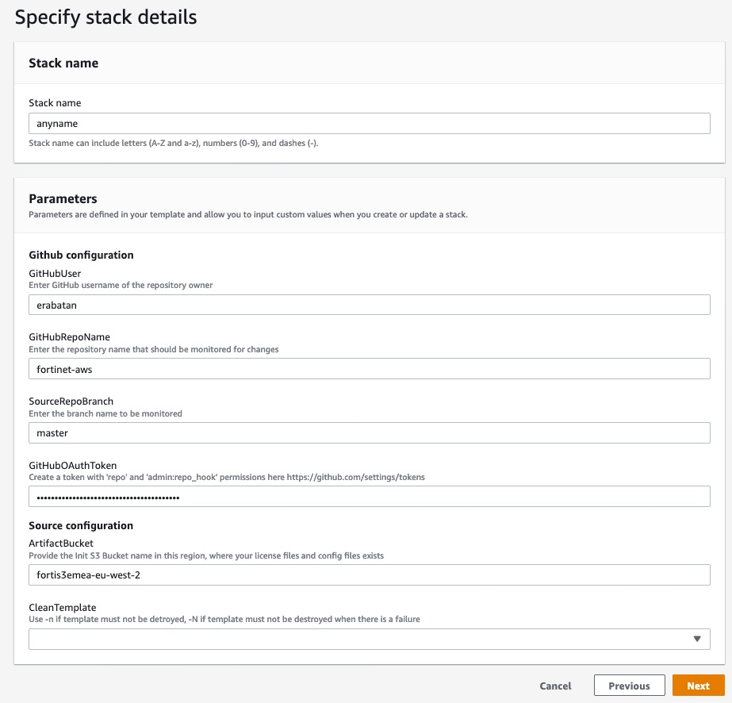

# CICD of your Fortinet resources

## Introduction

As your organization expands, more and more application are developed and moved to the cloud for many reasons: agility, scalability...Your infrastructure grows so rapidly that security of your data and your flows become more and more complex. Because the public cloud providers have a shared responsability model, it is your concern to integrate third party security solutions into your hybrid infrastructure. 
Using templates to test and quickly integrate these solutions make these moves easier. CICD approach helps you test, integrate, modify and adapt your infrastructure changes in a continuous way.

## Design

### About Taskcat
AWS provides a builtin application called [taskcat](https://aws-quickstart.github.io/auto-testing.html) which has been designed to test templates (CloudFormation stacks) and generates reports from this activity.
Taskcat application handles the following:
- Powers the Quick Start CI system. Every change that is published to the master branch of a Quick Start runs through TaskCat.
- Stages your code to Amazon S3 for testing in one or more regions.
- Uses a parameters file to pass input parameters to CreateStack.
- Uses runtime injection to dynamically generate stack inputs.
- Collects logs from the CloudFormation stack (including nested stacks).
- Cleans up stacks and staging assets.
- Generates test reports for every requested test region.

TaskCat supports all major Linux distributions and MacOS. (For Windows, use the Bash shell.)

### The added value of this template
Here we use specific AWS services like CodePipeline and CodeBuild to launch a linux container where taskcat will be automatically installed. CodePipeline is able to retrieve your templates from your Github repository before forwarding the content to CodeBuild for technical testing (creates stack, tests and generates reports via taskcat).

After you have installed this template, you will be able to automatically run tests of your templates everytime you commit a change to your github repository. 
Moreover this template generates an API Gateway so as you can trigger a test from any API call (Ex: a virtual button on your mobile, a curl command, etc.)

Here are the AWS services involved in this template:

## Deployment

For the deployment, you can use the CloudFormation template.json from AWS CloudFormation console.
Here is the information to fill up form for a smooth deployment:

### Prerequisites:
To run this template correctly, you need a S3 bucket in the same region as the stack with versionning enabled. 

- Copy the "ci" directory from the github account and add it to your repository. It contains at least 2 files:
  - taskcat.yml: this configuration file for taskcat declares all the variables used by the application to test the templates. You can specify the regions where the templates will be deployed for testing purposes and the name of the configuration file containing the parameters for the templates.  
  - taskcat_XXXXXX.json: it contains the parameters values for a specific testing scenario. 
- Create a folder (Ex: template) where you can store your template to be tested/deployed.
- Make sure you have configured the taskcat configuration files correctly and have a template in the previous folder.

For more information, please check [taskcat](https://aws-quickstart.github.io/auto-testing.html)  documentation. 

### 1. Run the template
- From AWS console, go to services > Cloudformation then click on "Create stack".
- Fill up the form with the following information:
  - Stack Name: can be any name to identify the stack.
  - GitHubUser: your Github account where you store your templates.
  - GitHubRepoName: the name of your repository where the taskcat config files and the templates are stored.
  - SourceRepoBranch: the name of the branch
  - GitHubOAuthToken: your personal access token to authenticate against your GitHub account. If you do not have one, please create one [here]("https://github.com/settings/tokens").
  - ArtifactBucket: the S3 bucket where the source files will be copied and your reports will be stored.
  - CleanTemplate: by default the stack of your template is created, analyzed and destroyed. You can decide not to destroy it (-n) or not to destroy it if any resource fails to be created (-N).

- Click [Next] at "Configure stack options".
- Tick the box "I acknowledge that AWS CloudFormation might create IAM resources with custom names" then [Next] at "Review <stackname>" 

- Click "create stack".

### 2. Configure your virtual button to make a nice demo (optional)
There are many ways to launch an API call. Here we propose two options: "curl" and/or "Flic". You can use "shortcut" which was tested successfully.

- Retrieve the API key: From AWS console, go to Lambda service. Click on "launchPipeline" link to the function.
- In the designer, click on "API Gateway" button: it will display the API Endpoint and the API key.

- Copy the API endpoint and the API key. 
- Install the application "Flic" on your smartphone.
- On the top right corner, click on the 3 spots icon to display the parameters. Choose widget.

- Rename your widget then click "+" as action. 

- At the bottom of the list of available applications, select "advanced" then "internet request".
- Configure the internet request with the details you have captured previously. 

- Do not forget to insert the key. You are ready to go !

You can also use the "curl" command from any terminal. The command is:
curl -v -X POST -H "x-api-key: your key" API endpoint

### 3. Test the workflow
You can test the workflow three ways:
- Commit any change to your template on your github account
- Use curl command to generate an API call to API gateway.
- Just push the virtual button in Flic application:

## Requirements and limitations

The names of your test scenarii in "ci" folder will be used to name the CloudFormation stacks and generate S3 buckets. Therefore you must use short names without capital letters or any forbidden caracter for S3 service.

## Support
Fortinet-provided scripts in this and other GitHub projects do not fall under the regular Fortinet technical support scope and are not supported by FortiCare Support Services.

## License
[License]: Apache 2.0 (qs-1ops82lkf). Taskcat application is AWS property.
